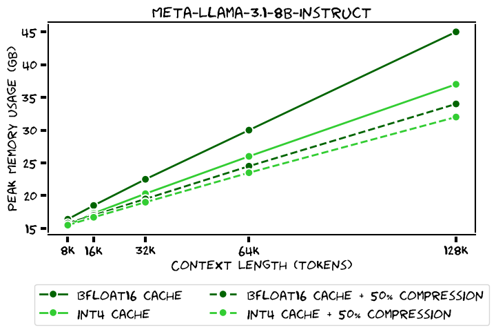
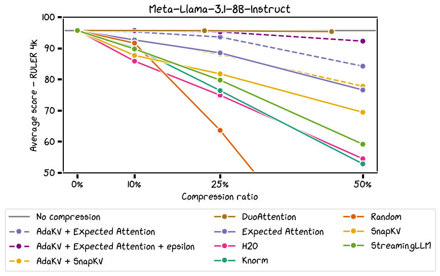

[](https://badge.fury.io/py/kvpress)
[](https://opensource.org/licenses/Apache-2.0)
[](https://colab.research.google.com/drive/1JNvaTKuuAHrl49dYB9-mdEH_y52Ib-NP?usp=drive_link)
[](https://huggingface.co/spaces/nvidia/kvpress)
[](https://huggingface.co/blog/nvidia/kvpress)


Deploying long-context LLMs is costly due to the linear growth of the key-value (KV) cache in transformer models. For example, handling 1M tokens with Llama 3.1-70B in float16 requires up to 330GB of memory. kvpress implements multiple KV cache compression methods and benchmarks using 🤗 transformers, aiming to simplify the development of new methods for researchers and developers in this field.

## Installation

```bash
pip install kvpress
```

If possible, install flash attention:
```bash
pip install flash-attn --no-build-isolation
```

## Usage

kvpress provides a set of "presses" that compress the KV cache during the prefilling-phase. Each press is associated with a `compression_ratio` attribute that measures the compression of the cache. The easiest way to use a press is through our custom `KVPressTextGenerationPipeline`. It is automatically registered as a transformers pipeline with the name "kv-press-text-generation" when kvpress is imported and handles chat templates and tokenization for you:

```python
from transformers import pipeline
from kvpress import ExpectedAttentionPress

device = "cuda:0"
model = "meta-llama/Llama-3.1-8B-Instruct"
model_kwargs = {"attn_implementation": "flash_attention_2"}
pipe = pipeline("kv-press-text-generation", model=model, device=device, model_kwargs=model_kwargs)

context = "A very long text you want to compress once and for all"
question = "\nA question about the compressed context"  # optional

press = ExpectedAttentionPress(compression_ratio=0.5)
answer = pipe(context, question=question, press=press)["answer"]
```

In the snippet above, the compression is only applied on the context tokens so that you can evaluate the compression for different questions. Check the [Wikipedia notebook demo](notebooks/wikipedia_demo.ipynb) for a more detailed example (also available on Colab [here](https://colab.research.google.com/drive/1JNvaTKuuAHrl49dYB9-mdEH_y52Ib-NP)).

> [!IMPORTANT]  
> We focus on compression during the pre-filling phase as the KV cache becomes a bottleneck for long-context sequence (100k - 1M tokens) which are essentially long context prompts. This would typically apply to improving prompt caching systems.

> [!NOTE]  
> Use `model_kwargs={"attn_implementation":"flash_attention_2"}` to enable flash attention. To use the press `ObservedAttentionPress`, you need to specify `model_kwargs={"attn_implementation":"eager"}` as this press requires to materialize the attention weights

## Contributing

We welcome contributions! To add a new press, simply open an issue or submit a pull request. Check the [new_press.ipynb](notebooks/new_press.ipynb) notebook for a step-by-step guide.

## Available presses

All current presses are training free and inherit from `BasePress` ([source](kvpress/presses/base_press.py)). 

Several presses inherit from `ScorerPress` ([source](kvpress/presses/scorer_press.py)) and rely on a score to prune the KV pairs with lowest importance:

- `RandomPress` ([source](kvpress/presses/random_press.py)): random score
- `KnormPress` ([source](kvpress/presses/knorm_press.py), [paper](https://arxiv.org/abs/2406.11430)): inverse norm of the key
- `SnapKVPress` ([source](kvpress/presses/snapkv_press.py), [paper](https://arxiv.org/abs/2404.14469)): average attention weight of the last queries
- `ExpectedAttentionPress` ([source](kvpress/presses/expected_attention_press.py), [notebook](notebooks/expected_attention.ipynb)): expected attention weight during the generation phase 
- `StreamingLLMPress` ([source](kvpress/presses/streaming_llm_press.py), [paper](https://arxiv.org/abs/2309.17453)): keep only the initial and recent tokens 
- `TOVAPress` ([source](kvpress/presses/tova_press.py), [paper](https://arxiv.org/abs/2401.06104)): attention weight of the last query averaged across heads 
- `ObservedAttentionPress` ([source](kvpress/presses/observed_attention_press.py), [paper](https://arxiv.org/abs/2306.14048)): average attention weight observed during in pre-filling phase
- `QFilterPress` ([source](kvpress/presses/qfilter_press.py), [paper](https://arxiv.org/abs/2503.02812)): project the Key representations on the main SVD component of the Query vectors to approximate the attention scores.

Some presses rely on a different logic:
- `ThinKPress` ([source](kvpress/presses/think_press.py), [paper](https://arxiv.org/pdf/2407.21018)): compress the dimensions of the keys based on the channel attention score on the last queries 
- `SimLayerKVPress` ([source](kvpress/presses/simlayerkv_press.py), [paper](https://arxiv.org/abs/2410.13846)): identify "lazy" layers, and apply the StreamingLLM approach to them 
- `DuoAttentionPress` ([source](kvpress/presses/duo_attention_press.py), [paper](https://arxiv.org/abs/2410.10819)): split heads into retrieval heads (no compression) and streaming heads (StreamingLLM approach)

Finally we provide wrapper presses that can be combined with other presses:
- `AdaKVPress` ([source](kvpress/presses/adakv_press.py), [paper](https://arxiv.org/abs/2407.11550)): prune bottom scores of any `ScorerPress` but across all heads, achieving head-wise compressions 
- `PerLayerCompressionPress` ([source](kvpress/presses/per_layer_compression_press.py)): compress each layer with a different compression ratio (experimental)
- `ComposedPress` ([source](kvpress/presses/composed_press.py)): compose multiple presses together by chaining their forward hooks
- `KeyRerotationPress` ([source](kvpress/presses/key_rerotation_press.py)): rerotate pruned keys to have continuous RoPE embeddings
- `ChunkKVPress` ([source](kvpress/presses/chunkkv_press.py), [paper](https://arxiv.org/abs/2502.00299)): compresses by selecting important chunks, preserving semantic coherence
- `ChunkPress` ([source](kvpress/presses/chunk_press.py), [paper](https://direct.mit.edu/tacl/article/doi/10.1162/tacl_a_00716/125280)): compress the KV cache on each sequence chunk separately. This can yield to more uniform compression across long sequences
- `CriticalKVPress` and `CriticalAdaKVPress` ([source](kvpress/presses/criticalkv_press.py), [paper](https://arxiv.org/abs/2502.03805)): refine the scores using the L1 norm of Wo @ values, coupled with a two-stage selection.
- `FinchPress` (([source](kvpress/presses/finch_press.py)), [paper](https://direct.mit.edu/tacl/article/doi/10.1162/tacl_a_00716/125280)): compress the KV cache using the prompt as condition.


For a detailed list of existing KV cache compression methods, check [Awesome-KV-Cache-Compression](https://github.com/October2001/Awesome-KV-Cache-Compression) or [Awesome-LLM-Compression](https://github.com/HuangOwen/Awesome-LLM-Compression?tab=readme-ov-file#kv-cache-compression)

## Evaluation

The [speed_and_memory.ipynb](notebooks/speed_and_memory.ipynb) notebook can help you to measure peak memory usage and total time gain.



We provide a simple CLI to evaluate the performance of the different presses on several long-context datasets. Below we report the average performance on the RULER dataset with 4k context length for different presses.



Please refer to the [evaluation](evaluation/README.md) directory for more details and results.

## Quantization

We support KV cache quantization through the transformers `QuantizedCache` class (see [HF blog post](https://huggingface.co/blog/kv-cache-quantization#how-to-use-quantized-kv-cache-in-%F0%9F%A4%97-transformers)). To use it, simply pass a cache object to your pipeline:

```python
from transformers import QuantizedCacheConfig, QuantoQuantizedCache

config = QuantizedCacheConfig(nbits=4)
cache = QuantoQuantizedCache(config)

pipe(..., cache=cache)
```

By default, the `DynamicCache` is used (no quantization). 

> [!IMPORTANT]  
> To use the `QuantizedCache`, you need to install additional dependencies (_e.g._ `pip install optimum-quanto`).

## FAQ

<details><summary> 

### Which models are supported ? 
</summary>

Some presses depend on the model architecture (_e.g._ `ExpectedAttentionPress` or `SnapKVPress`) hence they might not work with all models. We tested support for `LlamaForCausalLM`, `MistralForCausalLM`, `Phi3ForCausalLM` and `Qwen2ForCausalLM` but many other models might be supported out of the box because their implementation is often similar in transformers.
</details>

<details><summary> 

### How to run inference on multiple GPUs ? 
</summary>

kvpress supports multi-GPU inference through [accelerate](https://huggingface.co/docs/accelerate/en/index):

```python
pipe = pipeline("kv-press-text-generation", model=model, device_map="auto")
```

</details>


<details> <summary> 

### What are the memory and throughput gains ?
</summary>

Memory usage should be reduced by around `compression_ratio * kv_cache_size`. As the KV cache is smaller, decoding should also be faster. You can measure peak memory usage gain and total time gain using [this notebook](notebooks/speed_and_memory.ipynb).
</details>


<details> <summary> 

### How does a press work ? </summary>

A press registers a forward hook (`press.forward_hook` method) to each attention layer during the pre-filling phase. Registration can be applied using the press as a context manager (`press.__call__` method):

```python
import torch
from transformers import AutoModelForCausalLM
from kvpress import KnormPress

device = "cuda:0"
ckpt = "meta-llama/Meta-Llama-3.1-8B-Instruct"
model = AutoModelForCausalLM.from_pretrained(ckpt).to(device)
press = KnormPress(compression_ratio=0.4)

inputs = model.dummy_inputs["input_ids"].to(device)

with torch.no_grad():
    print(model(inputs).past_key_values[0][0].shape)
    # torch.Size([3, 8, 5, 128])
    
with torch.no_grad(), press(model):
    print(model(inputs).past_key_values[0][0].shape)
    # torch.Size([3, 8, 3, 128])
```
</details>

<details><summary> 

### Why not using model.generate ? 
</summary>

In fact you can use `model.generate` with a press by using the press as a context manager:

```python
with press(model):
    outputs = model.generate(inputs)
```

However, the `generate` method does not allow to exclude the question from the compression, which would artificially favors methods such as SnapKV. Ideally, we want a compression method that works whatever comes after the context (_e.g._ for use cases such as chat or document question answering). Finally the `generate` method does not allow to provide generation for multiple questions at once.

</details>